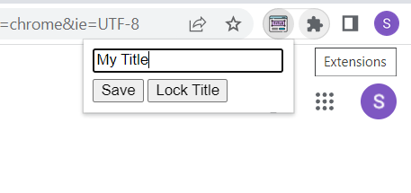

# Rename Tab Title
Start the extension by clicking on the extension icon or use the keyboard shortcut ```Ctrl+Shift+H```.



## **Features**
### ***Save Button***
On clicking on the save button, title of the page is changed temporarily and it will be restored once the page is reloaded.

### ***Lock Title Button***
On clicking this button, that particular tab will maintain the entered title throughout the tab session - even on page reloads.
